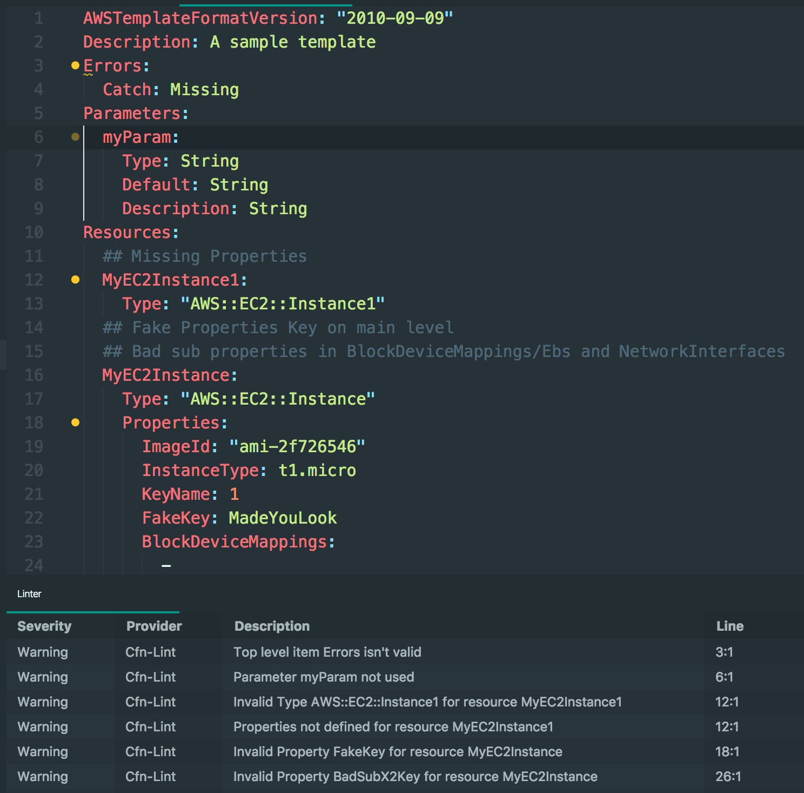
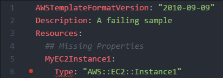

## AWS Cfn Lint Atom
Provides IDE specific integration to [cfn-lint](https://github.com/awslabs/cfn-python-lint)



## Requires
#### cfn-lint
For atom-cfn-lint to work you need to have cfn-lint installed.
```pip install cfn-lint```

## Verify Installation
#### JSON/YAML Templates
Atom-cfn-lint will work with JSON and YAML files but the goal is to only scan CloudFormation templates.  As a result we look for `AWSTemplateFormatVersion` being defined in the file.  CloudFormation only requires `Resources` to be defined but this is too generic for assuming that the file is a CloudFormation template.

##### Example
You can use the following example to verify that the installation was successful:
```YAML
AWSTemplateFormatVersion: "2010-09-09"
Resources:
  # Unsupported Type "AWS::EC2::Instance1"
  MyEC2Instance1:
    Type: "AWS::EC2::Instance1"
```

Result (`Type` is marked as an error):



See [Templates](spec/fixtures/templates/) for more examples.

## Contribute

The code for this plugin can be found on GitHub at [awslabs/aws-cfn-lint-atom](https://github.com/awslabs/aws-cfn-lint-atom)

## License

This library is licensed under the Apache 2.0 License.
